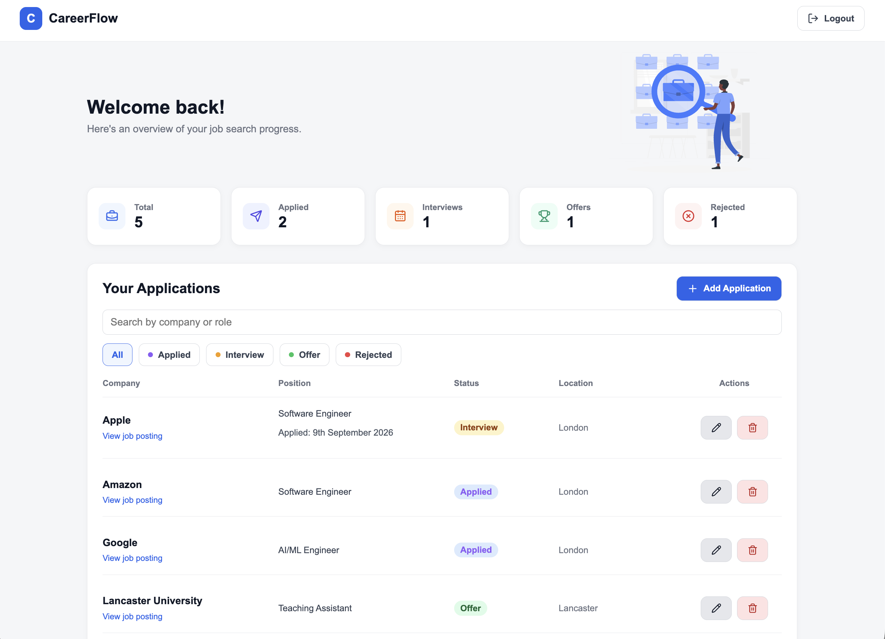
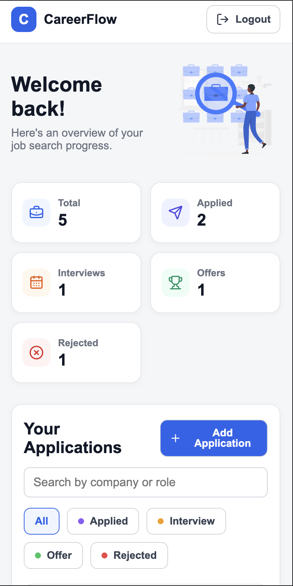
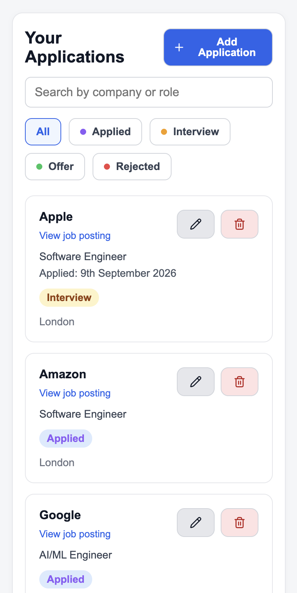

# CareerFlow

CareerFlow is a full-stack web application for tracking job applications throughout the recruitment process. Users can securely create an account, manage their applications, track progress from application to offer, and keep relevant job details and notes in one place.

## Live Demo

- [View CareerFlow](https://careerflow-frontend-mgua.onrender.com)
- [View API Documentation](https://careerflow-backend-8ab9.onrender.com/docs)

> The backend is hosted on Render's free tier and may take a short time to respond after a period of inactivity.

## Features

- Secure user registration and authentication
- Create, edit, and delete job applications
- Track application progress through different recruitment stages
- Search and filter applications
- View dashboard statistics for application progress
- Store job details, links, and notes
- Per-user application management and data isolation
- Responsive design for desktop, tablet, and mobile

## Tech Stack

| Area       | Technologies                                 |
| ---------- | -------------------------------------------- |
| Frontend   | React, Vite, React Router, CSS, Lucide React |
| Backend    | Python, FastAPI, SQLAlchemy, Pydantic, JWT   |
| Database   | PostgreSQL, Alembic, Neon                    |
| Testing    | Pytest, Vitest, React Testing Library        |
| Deployment | Render, Neon                                 |

## Architecture

CareerFlow uses a client-server architecture with a React frontend communicating with a FastAPI REST API.

- The **React frontend** handles the user interface, routing, authentication state, and application management.
- The **FastAPI backend** provides authentication and job application endpoints, validates requests, and enforces per-user data access.
- **JWT tokens** are used to authenticate protected API requests.
- **SQLAlchemy** provides the ORM layer between the API and PostgreSQL.
- **PostgreSQL** stores user accounts and job application data, with schema changes managed through Alembic migrations.
- In production, the frontend and backend are hosted on **Render**, while the PostgreSQL database is hosted on **Neon**.

## Getting Started

### Prerequisites

Make sure you have the following installed:

- Python 3
- Node.js and npm
- PostgreSQL
- Git

### 1. Clone the repository

```bash
git clone https://github.com/adam-2005-99/careerflow.git
cd careerflow
```

### 2. Set up the backend

```bash
cd backend

python -m venv venv
source venv/bin/activate

pip install -r requirements.txt
```

Create a `.env` file inside the `backend` directory:

```env
DATABASE_URL=postgresql://<username>:<password>@localhost:5432/careerflow
SECRET_KEY=<your-secret-key>
ALGORITHM=HS256
ACCESS_TOKEN_EXPIRE_MINUTES=30
FRONTEND_URL=http://localhost:5173
```

Create the PostgreSQL database, then apply the database migrations:

```bash
createdb careerflow

alembic upgrade head
```

Start the FastAPI development server:

```bash
uvicorn main:app --reload
```

The API will be available at `http://127.0.0.1:8000`.

### 3. Set up the frontend

Open another terminal from the project root:

```bash
cd frontend
npm install
```

Create a `.env` file inside the `frontend` directory:

```env
VITE_API_URL=http://127.0.0.1:8000
```

Start the development server:

```bash
npm run dev
```

The application will be available at `http://localhost:5173`.

## Testing

CareerFlow includes automated tests for both the backend and frontend.

### Backend

Backend tests cover authentication, application CRUD operations, authorization, and validation.

```bash
cd backend
python -m pytest
```

### Frontend

Frontend tests use Vitest and React Testing Library to test authentication and protected routing behaviour.

```bash
cd frontend
npm test
```

## Screenshots

### Desktop View



### Mobile View

<p>
  
  
</p>
